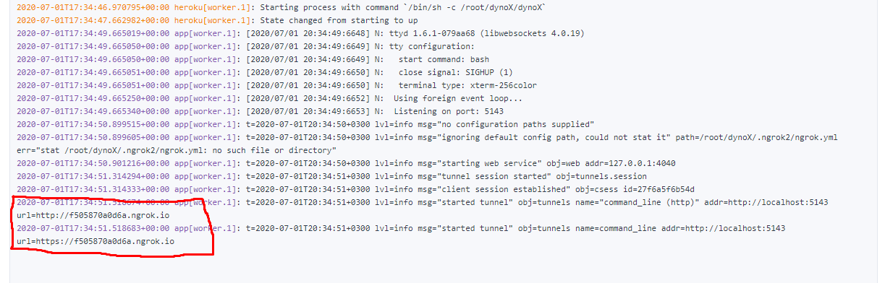
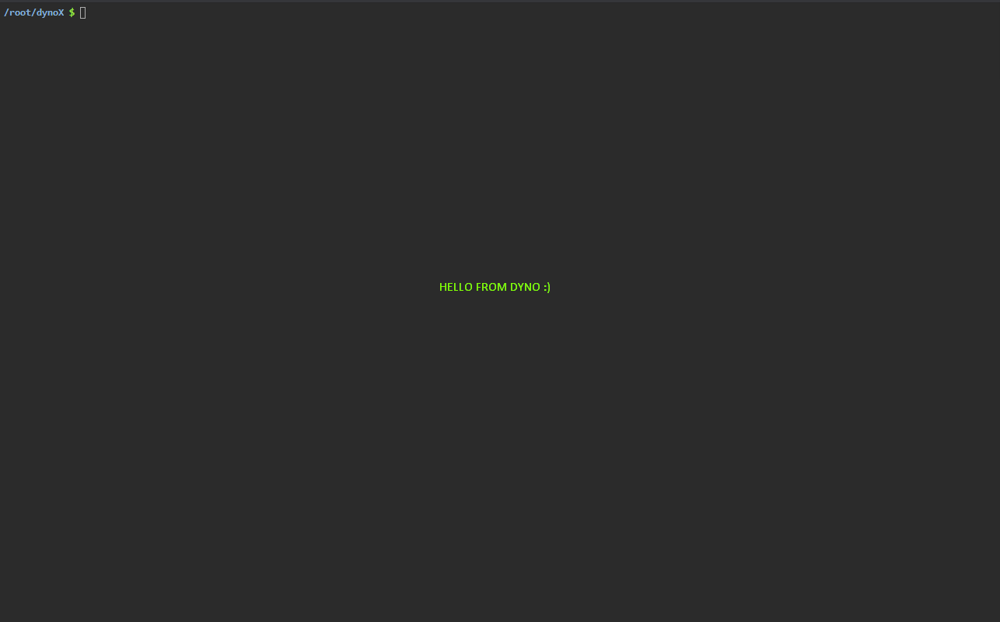

# dynoX
## Heroku Bash'ına TTYD ve NGROK ile Erişin

### Kullanımı:
#### 1- "Deploy to Heroku" Butonuna Tıklayın
#### 2- Deploy İşlemi Bittikten Sonra Workeri Başlatın
#### 3- Worker Günlüklerini(Log) Açın

## NGROK ADRESİNİ ALIP TTYD OTURUMUNA GİRİN!
### Telegram Gruplarımız

## Ekran Görüntüleri

